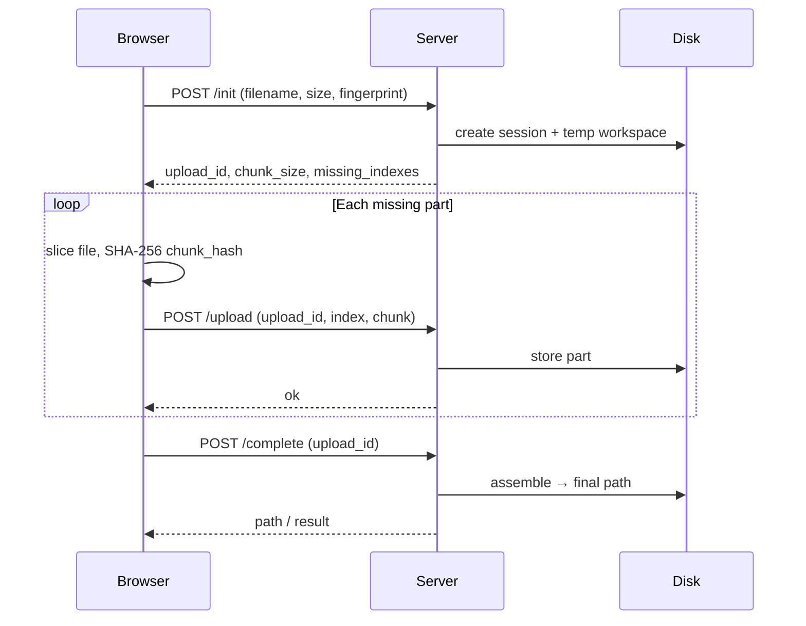

# Pinion — Resumable Upload Protocol for PHP

**Pinion** (`pinoox/pinion`) lets users upload large files in small parts — even when PHP `upload_max_filesize` / `post_max_size` are low.

Protocol id: `pinion` · version: `2` · PHP 8.1+

| Registry | Package |
|----------|---------|
| Packagist (server) | `pinoox/pinion` |
| npm (browser) | `@pinooxhq/pinion-client` |

---

## Quick start

### 1 — Install

```bash
composer require pinoox/pinion          # PHP server
npm install @pinooxhq/pinion-client       # browser (fetch, no Axios required)
```

### 2 — Server: three HTTP steps

```php
use Pinoox\Pinion\Pinion;

Pinion::configure(['storage_path' => '/tmp/pinion']);

$handler = Pinion::http(['destination' => 'uploads/videos']);

$handler->init($_POST);           // POST …/init
$handler->upload($_POST, $file);  // POST …/upload  (one chunk)
$handler->complete($_POST);       // POST …/complete
```

### 3 — Browser: one function

```javascript
import { uploadFile } from '@pinooxhq/pinion-client';

await uploadFile(file, {
  baseURL: '/api/v1/upload',   // prefix — see [Routing](#routing--baseurl)
  unwrapPreset: 'pinoox',
  onProgress: ({ percent }) => console.log(percent + '%'),
});
```

That is the whole idea: **init → upload parts → complete**. The client does the loop for you.

---

## Table of contents

- [Quick start](#quick-start)
- [What is Pinion](#what-is-pinion)
- [How it works](#how-it-works)
- [Install](#install)
- [Level 1 — Simple](#level-1--simple)
  - [Browser: upload one file](#browser-upload-one-file)
  - [Server: wire HTTP routes](#server-wire-http-routes)
  - [Routing & baseURL](#routing--baseurl)
- [Level 2 — Practical patterns](#level-2--practical-patterns)
  - [Reusable uploader](#reusable-uploader)
  - [Progress, retry, parallel](#progress-retry-parallel)
  - [Small files vs large files](#small-files-vs-large-files)
  - [Auth headers & CORS](#auth-headers--cors)
- [Level 3 — Framework integration](#level-3--framework-integration)
  - [Plain PHP](#plain-php)
  - [Pinoox](#pinoox)
  - [Laravel](#laravel)
- [Level 4 — Advanced](#level-4--advanced)
  - [Programmatic API (no HTTP)](#programmatic-api-no-http)
  - [Resume & fingerprint](#resume--fingerprint)
  - [Checksums & integrity](#checksums--integrity)
  - [Configuration reference](#configuration-reference)
  - [Storage strategies](#storage-strategies)
  - [Custom destinations](#custom-destinations)
  - [Maintenance & CLI](#maintenance--cli)
- [HTTP protocol (full reference)](#http-protocol-full-reference)
- [Browser client (full reference)](#browser-client-full-reference)
- [PHP API surface](#php-api-surface)
- [Troubleshooting](#troubleshooting)
- [Package structure](#package-structure)
- [License](#license)

---

## What is Pinion

### The problem

On shared hosting or default PHP configs you often hit limits like:

```ini
upload_max_filesize = 20M
post_max_size = 20M
```

A 500 MB video cannot be sent in one `multipart/form-data` request. Pinion splits the file into **parts** (default 5 MB), uploads them one by one, and **assembles** the final file on disk.

### What Pinion is — and is not

| Pinion **is** | Pinion **is not** |
|---------------|-------------------|
| A resumable chunked upload protocol | Object storage (S3, MinIO) |
| A PHP library + JS client | A CDN or media pipeline |
| A stable HTTP contract (`pinion` v2) | A single `/upload` one-shot endpoint |

### When to use it

| Scenario | Why Pinion |
|----------|------------|
| Shared hosting (20 MB cap) | Send 5 MB parts instead of one huge POST |
| Slow or mobile networks | Resume after disconnect via `fingerprint` |
| Video / archive uploads | Hundreds of MB or GB without raising `php.ini` limits |
| Admin panels & CMS | Progress bar with parallel parts |
| API file intake | Same contract across PHP stacks |
| Integrity-sensitive files | SHA-256 per part (`chunk_hash`) + optional whole-file hash |

---

## How it works



**Key concepts:**

| Concept | Role |
|---------|------|
| `upload_id` | Server-side session UUID |
| `fingerprint` | Client key `name:size:lastModified:type` — resume same file |
| `chunk_size` | Bytes per part (negotiated at init) |
| `missing_indexes` | Which parts still need uploading |
| `chunk_hash` | SHA-256 of each part — verified if `verify_chunks` is on |
| `destination` | Logical folder on server (`uploads/videos`) |

---

## Install

### PHP — Packagist

```bash
composer require pinoox/pinion
```

**Pinoox monorepo** (local path):

```json
{
  "repositories": [{"type": "path", "url": "packages/pinion"}],
  "require": {"pinoox/pinion": "@dev"}
}
```

### JavaScript — npm

```bash
npm install @pinooxhq/pinion-client
# optional, for per-chunk Axios progress:
npm install axios
```

### Without npm (vendor copy)

```javascript
import { createPinionClient } from './vendor/pinoox/pinion/client/src/index.js';
```

---

## Level 1 — Simple

### Browser: upload one file

The fastest API — no setup object, no Axios:

```javascript
import { uploadFile } from '@pinooxhq/pinion-client';

const file = input.files[0];

const result = await uploadFile(file, {
  baseURL: '/api/v1/upload',
  unwrapPreset: 'pinoox',
  onProgress: ({ percent }) => {
    progressBar.style.width = percent + '%';
  },
});

console.log('Done:', result);
```

`unwrapPreset: 'pinoox'` unwraps responses shaped like `{ data: { … } }` (Pinoox / Laravel envelope). Use `'flat'` if your API returns the payload directly.

### Server: wire HTTP routes

Pinion needs **five endpoints** under one prefix. You choose the prefix; the client appends `/init`, `/upload`, etc.

**Example prefix:** `/api/v1/upload`

| Method | Route | Handler |
|--------|-------|---------|
| `POST` | `/api/v1/upload/init` | `$handler->init($input)` |
| `POST` | `/api/v1/upload/upload` | `$handler->upload($input, $chunkFile)` |
| `POST` | `/api/v1/upload/complete` | `$handler->complete($input)` |
| `GET` | `/api/v1/upload/status/{id}` | `$handler->status($id)` |
| `POST` | `/api/v1/upload/abort/{id}` | `$handler->abort($id)` |

Minimal PHP router (no framework):

```php
<?php
use Pinoox\Pinion\Pinion;

require 'vendor/autoload.php';

Pinion::configure(['storage_path' => __DIR__ . '/storage/pinion-temp']);

$handler = Pinion::http(['destination' => 'uploads/inbox']);

$uri = parse_url($_SERVER['REQUEST_URI'], PHP_URL_PATH);
$method = $_SERVER['REQUEST_METHOD'];

$response = match (true) {
    $method === 'POST' && str_ends_with($uri, '/init')
        => $handler->init($_POST),

    $method === 'POST' && str_ends_with($uri, '/upload')
        => $handler->upload($_POST, $_FILES['chunk'] ?? null),

    $method === 'POST' && str_ends_with($uri, '/complete')
        => $handler->complete($_POST),

    $method === 'GET' && preg_match('#/status/([a-f0-9-]+)$#', $uri, $m)
        => $handler->status($m[1]),

    $method === 'POST' && preg_match('#/abort/([a-f0-9-]+)$#', $uri, $m)
        => $handler->abort($m[1]),

    default => ['success' => false, 'error' => ['code' => 'PINION_UNKNOWN', 'message' => 'not_found']],
};

header('Content-Type: application/json');
echo json_encode($response);
```

Return JSON from `HttpHandler` as-is, or map `success` / `data` / `error` to your framework response helper.

### Routing & baseURL

`baseURL` in the JS client is the **prefix only** — not a single upload URL.

| Your routes | `baseURL` in client |
|-------------|---------------------|
| `/api/v1/upload/init`, `/upload`, … | `'/api/v1/upload'` |
| `/api/pinion/init`, … | `'/api/pinion'` |
| `/app/pinion/init`, … (Pinoox manager) | `'/app/pinion'` |

The client calls:

```
POST {baseURL}/init
POST {baseURL}/upload
POST {baseURL}/complete
GET  {baseURL}/status/{upload_id}
POST {baseURL}/abort/{upload_id}
```

If you only have **one** endpoint `POST /api/v1/upload` for a regular single-file upload, that is **not** Pinion — use `FormData` + `fetch` instead.

---

## Level 2 — Practical patterns

### Reusable uploader

Create one client, upload many files:

```javascript
import { pinion } from '@pinooxhq/pinion-client';

const uploader = pinion({
  baseURL: '/api/v1/upload',
  unwrapPreset: 'pinoox',
  headers: { Authorization: 'Bearer ' + token },
  destination: 'uploads/media',
  extensions: ['mp4', 'zip', 'pdf'],
});

// one file
await uploader.for(file).upload();

// check before uploading
if (!uploader.for(smallFile).needsPinion()) {
  await regularUpload(smallFile);
} else {
  await uploader.for(largeFile).upload();
}
```

### Progress, retry, parallel

```javascript
await uploader.for(file).upload({
  parallel: 2,          // upload 2 parts at once
  retry: 2,             // retry failed parts
  retryDelayMs: 800,
  onProgress: ({ percent, bytesUploaded, bytesTotal, speed, eta }) => {
    console.log(`${percent}% · ${speed} B/s · ETA ${eta}s`);
  },
  onChunkStart: (index) => console.log('starting part', index),
  onChunkComplete: (index) => console.log('done part', index),
  onError: (err, index) => console.warn(err.code, index),
});
```

With **Axios** (optional) you also get raw per-chunk upload events:

```javascript
import axios from 'axios';
import { pinion } from '@pinooxhq/pinion-client';

const uploader = pinion(axios, { baseURL: '/api/v1/upload', unwrapPreset: 'pinoox' });

await uploader.for(file).upload({
  onUploadProgress: (event, index) => console.log('part', index, event.loaded),
});
```

### Small files vs large files

Use `auto` to skip Pinion for files below a threshold (default 8 MB):

```javascript
const result = await uploadFile(file, {
  baseURL: '/api/v1/upload',
  auto: true,
  threshold: 8 * 1024 * 1024,
});

if (result === null) {
  // small file — use your normal single POST
  const form = new FormData();
  form.append('file', file);
  await fetch('/api/v1/upload/simple', { method: 'POST', body: form });
}
```

### Auth headers & CORS

Pass headers once on the client — they apply to every step (`init`, `upload`, `complete`):

```javascript
const uploader = pinion({
  baseURL: '/api/v1/upload',
  unwrapPreset: 'pinoox',
  headers: {
    Authorization: 'Bearer ' + token,
    'X-App-Id': 'portal',
  },
});
```

On the server, ensure CORS allows `POST` + `GET` on all five routes if the frontend is on another origin.

### Cancel an upload

```javascript
const controller = new AbortController();
uploader.for(file).upload({ signal: controller.signal });
controller.abort();

// or
uploader.cancel();
```

### Batch upload

```javascript
import { createPinionFetch } from '@pinooxhq/pinion-client';

const client = createPinionFetch({ baseURL: '/api/v1/upload', unwrapPreset: 'pinoox' });

await client.uploadMany([file1, file2, file3], {
  fileParallel: 1,
  onFileStart: (f, i) => console.log('file', i, f.name),
  onFileComplete: (f, result, i) => console.log('done', i, result),
});
```

---

## Level 3 — Framework integration

### Plain PHP

**HTTP handler** — recommended for web apps:

```php
use Pinoox\Pinion\Pinion;
use Pinoox\Pinion\Support\NativePathResolver;

Pinion::configure([
    'storage_path' => '/var/www/storage/pinion-temp',
    'chunk_size' => 5 * 1024 * 1024,
    'verify_chunks' => true,
], new NativePathResolver('/var/www'));

$handler = Pinion::http([
    'destination' => 'uploads/documents',
    'extensions' => ['pdf', 'docx'],
]);
```

**Fluent builder** — for scripts and jobs:

```php
$result = Pinion::begin()
    ->filename('report-Q1.pdf')
    ->size(48_000_000)
    ->to('uploads/documents')
    ->extensions(['pdf'])
    ->fingerprint($clientFingerprint)
    ->chunkSize('5MB')
    ->init();

if (!$result->success) {
    exit($result->error);
}

$uploadId = $result->session->id;

foreach ($result->session->missingIndexes() as $index) {
    Pinion::manager()->receive($uploadId, $index, $chunkBinary, $chunkHash);
}

$complete = Pinion::manager()->complete($uploadId);
// $complete->path → absolute path on disk
```

### Pinoox

Inside a Pinoox project use the **Portal** — config and storage are already wired.

```php
use Pinoox\Portal\Pinion;
use Pinoox\Component\Http\Request;

// programmatic
$result = Pinion::begin()
    ->filename('backup-2026.zip')
    ->size(524288000)
    ->to('downloads/archives')
    ->extensions(['zip', 'tar', 'gz'])
    ->fingerprint($clientFingerprint)
    ->init();
```

Controller (JSON API):

```php
class PinionController extends ApiController
{
    private function handler()
    {
        return Pinion::http([
            'destination' => 'uploads/media',
            'extensions' => ['mp4', 'mov', 'webm'],
        ]);
    }

    public function init(Request $request)     { return $this->handler()->init($request); }
    public function upload(Request $request)   { return $this->handler()->upload($request); }
    public function complete(Request $request) { return $this->handler()->complete($request); }
    public function status(string $uploadId)   { return $this->handler()->status($uploadId); }
    public function abort(string $uploadId)    { return $this->handler()->abort($uploadId); }
}
```

Default manager routes:

```
POST /app/pinion/init
POST /app/pinion/upload
POST /app/pinion/complete
GET  /app/pinion/status/{uploadId}
POST /app/pinion/abort/{uploadId}
```

→ client: `baseURL: '/app/pinion'`

Config: `pincore/config/pinion.config.php` · temp storage: `storage/pinion`

CLI:

```bash
php pinoox pinion:list
php pinoox pinion:info {upload_id}
php pinoox pinion:clean --abort={upload_id}
```

Extended guide: [docs/en/advanced/pinion.md](../docs/en/advanced/pinion.md)

### Laravel

Laravel 10+ — auto-discovery via `PinionServiceProvider`.

**1. Publish config**

```bash
php artisan vendor:publish --tag=pinion-config
```

**2. Routes** (`routes/api.php`)

```php
use App\Http\Controllers\PinionUploadController;

Route::prefix('api/v1/upload')->group(function () {
    Route::post('init', [PinionUploadController::class, 'init']);
    Route::post('upload', [PinionUploadController::class, 'upload']);
    Route::post('complete', [PinionUploadController::class, 'complete']);
    Route::get('status/{uploadId}', [PinionUploadController::class, 'status']);
    Route::post('abort/{uploadId}', [PinionUploadController::class, 'abort']);
});
```

**3. Controller**

```php
namespace App\Http\Controllers;

use Illuminate\Http\JsonResponse;
use Illuminate\Http\Request;
use Pinoox\Pinion\HttpHandler;

final class PinionUploadController extends Controller
{
    public function __construct(private readonly HttpHandler $pinion) {}

    public function init(Request $request): JsonResponse
    {
        return $this->json($this->pinion->init($request->all()));
    }

    public function upload(Request $request): JsonResponse
    {
        return $this->json($this->pinion->upload($request->all(), $request->file('chunk')));
    }

    public function complete(Request $request): JsonResponse
    {
        return $this->json($this->pinion->complete($request->all()));
    }

    public function status(string $uploadId): JsonResponse
    {
        return $this->json($this->pinion->status($uploadId));
    }

    public function abort(string $uploadId): JsonResponse
    {
        return $this->json($this->pinion->abort($uploadId));
    }

    private function json(array $payload): JsonResponse
    {
        $status = (int) ($payload['status'] ?? ($payload['success'] ? 200 : 400));

        return response()->json(
            $payload['success'] ? ($payload['data'] ?? null) : ($payload['error'] ?? $payload),
            $status,
        );
    }
}
```

**4. Facade** (server-side jobs)

```php
use Pinoox\Pinion\Laravel\Facades\Pinion;

$result = Pinion::begin()
    ->filename('dataset-export.csv')
    ->size(filesize($path))
    ->to('exports')
    ->init();
```

---

## Level 4 — Advanced

### Programmatic API (no HTTP)

Use `Manager` directly when chunks arrive from CLI, queue workers, or non-HTTP sources:

```php
$manager = Pinion::manager();

$result = $manager->init(
    filename: 'archive.zip',
    size: 1_073_741_824,
    destination: 'uploads/archives',
    extensions: ['zip'],
    fingerprint: $clientFingerprint,
);

$session = $result->session;
$manager->receive($session->id, 0, $binary, $chunkHash);
$manager->receive($session->id, 1, $binary, $chunkHash);
// …

$done = $manager->complete($session->id);
echo $done->path;
```

Low-level browser control (manual steps):

```javascript
import { createPinionFetch, sha256Hex } from '@pinooxhq/pinion-client';

const client = createPinionFetch({ baseURL: '/api/v1/upload', unwrapPreset: 'pinoox' });

const session = await client.api.init({
  filename: file.name,
  size: file.size,
  fingerprint: client.buildFingerprint(file),
});

const blob = file.slice(0, session.chunk_size);
const form = new FormData();
form.append('upload_id', session.id);
form.append('index', '0');
form.append('chunk_hash', await sha256Hex(blob));
form.append('chunk', blob);

await client.api.uploadPart(form);
await client.api.complete(session.id);
```

### Resume & fingerprint

The client builds a **fingerprint** from file metadata:

```
{name}:{size}:{lastModified}:{type}
```

On `init`, if the same `fingerprint` already has a pending session, the server returns it with `resumed: true` and `missing_indexes` — only missing parts are uploaded.

The JS client caches `upload_id` in `localStorage` (key: `pinion_sessions`) until `complete` succeeds.

Force resume explicitly:

```javascript
await uploader.for(file).resume({ parallel: 2 });
// same as upload() — both run the full init → parts → complete flow
```

Check stored session:

```javascript
const fp = uploader.buildFingerprint(file);
const cached = uploader.getStoredSession(fp);
```

### Checksums & integrity

| Field | When | Purpose |
|-------|------|---------|
| `chunk_hash` | Each `POST /upload` | SHA-256 of that part — verified when `verify_chunks: true` |
| `file_hash` | `POST /init` or `/complete` | Optional whole-file hash — verified when `verify_file_hash: true` |

Client sends `chunk_hash` automatically. To send whole-file hash on complete:

```javascript
import { sha256Hex } from '@pinooxhq/pinion-client';

const fileHash = await sha256Hex(file);

await uploader.for(file).upload({ fileHash });
```

### Configuration reference

Pass to `Pinion::configure()` or copy `config/pinion.php`.

| Key | Default | Description |
|-----|---------|-------------|
| `protocol` | `pinion` | Protocol identifier (read-only in responses) |
| `protocol_version` | `2` | Protocol version |
| `chunk_size` | `5242880` (5 MB) | Default part size |
| `min_chunk_size` | `1048576` (1 MB) | Lower clamp |
| `max_chunk_size` | `10485760` (10 MB) | Upper clamp |
| `ttl` | `86400` | Session lifetime (seconds) |
| `max_file_size` | `2147483648` (2 GB) | Max declared file size |
| `storage_path` | `/tmp/pinion` | Temp workspace for in-progress uploads |
| `storage_strategy` | `parts` | `parts` or `sparse` |
| `verify_chunks` | `true` | Require matching `chunk_hash` |
| `verify_file_hash` | `false` | Require `file_hash` on complete |

**Laravel `.env`:**

```env
PINION_CHUNK_SIZE=5242880
PINION_TTL=86400
PINION_MAX_FILE=2147483648
PINION_PATH=/var/www/storage/pinion-temp
PINION_STRATEGY=parts
PINION_VERIFY_CHUNKS=true
PINION_VERIFY_FILE=false
```

**Per-request defaults** via `HttpHandler`:

```php
$handler = Pinion::http([
    'destination' => 'uploads/videos',
    'extensions' => ['mp4', 'mov'],
]);
// client can override destination per init, or use these defaults
```

### Storage strategies

| Strategy | On disk | Best for |
|----------|---------|----------|
| `parts` | `{id}/parts/0.part`, `1.part`, … | Parallel client uploads (default) |
| `sparse` | Single `{id}/blob.part` with offset writes | Fewer files, sequential writes |

Temp files live under `storage_path`. On `complete`, the assembled file moves to the resolved `destination`. Expired pending sessions are cleaned via `cleanExpired()`.

### Custom destinations

By default `NativePathResolver` maps `to('uploads/videos')` relative to a base path. For multi-root apps implement `PathResolverInterface`:

```php
use Pinoox\Pinion\Contract\PathResolverInterface;

final class AppPathResolver implements PathResolverInterface
{
    public function resolve(string $reference): string
    {
        return match ($reference) {
            'videos' => '/data/media/videos',
            'documents' => '/data/media/docs',
            default => '/data/media/' . ltrim($reference, '/'),
        };
    }
}

Pinion::configure($config, new AppPathResolver());
```

### Maintenance & CLI

```php
$session = Pinion::manager()->status($uploadId);
// → progress, missing_indexes, bytes_received

$pending = Pinion::manager()->list('pending');
$removed = Pinion::manager()->cleanExpired();
Pinion::manager()->abort($uploadId);
```

Pinoox CLI:

```bash
php pinoox pinion:list
php pinoox pinion:info a1b2c3d4-...
php pinoox pinion:clean
php pinoox pinion:clean --abort=a1b2c3d4-...
```

---

## HTTP protocol (full reference)

### Endpoints

| Step | Method | Path | Body |
|------|--------|------|------|
| Init / resume | `POST` | `{prefix}/init` | JSON |
| Upload part | `POST` | `{prefix}/upload` | `multipart/form-data` |
| Complete | `POST` | `{prefix}/complete` | JSON |
| Status | `GET` | `{prefix}/status/{upload_id}` | — |
| Abort | `POST` | `{prefix}/abort/{upload_id}` | JSON (optional) |

### Init request

```json
{
  "filename": "course-video.mp4",
  "size": 524288000,
  "destination": "uploads/videos",
  "fingerprint": "video.mp4:524288000:1718640000000:video/mp4",
  "chunk_size": 5242880,
  "mime": "video/mp4",
  "extensions": ["mp4", "mov"],
  "file_hash": null,
  "meta": { "user_id": 42 }
}
```

### Init response

```json
{
  "id": "a1b2c3d4-e5f6-4789-a012-3456789abcde",
  "filename": "course-video.mp4",
  "size": 524288000,
  "chunk_size": 5242880,
  "total_chunks": 100,
  "bytes_received": 0,
  "missing_indexes": [0, 1, 2, 3],
  "protocol": "pinion",
  "protocol_version": 2,
  "resumable": true,
  "resumed": false
}
```

Same `fingerprint` on a pending session → `resumed: true`, `missing_indexes` only lists gaps.

### Upload part request

`multipart/form-data` fields:

| Field | Required | Notes |
|-------|----------|-------|
| `upload_id` | yes | Session UUID |
| `index` | yes | Zero-based part index |
| `chunk` | yes | Binary file field |
| `chunk_hash` | recommended | SHA-256 hex of `chunk` |

**Do not** set `Content-Type: multipart/form-data` manually — let the client / browser set the boundary.

### Complete request

```json
{
  "upload_id": "a1b2c3d4-e5f6-4789-a012-3456789abcde",
  "file_hash": "optional-sha256-of-whole-file"
}
```

### Error envelope

`HttpHandler` returns:

```json
{
  "success": false,
  "status": 400,
  "error": {
    "code": "PINION_INVALID",
    "message": "invalid_chunk_request",
    "details": {}
  }
}
```

Common codes: `PINION_INIT_FAILED`, `PINION_INVALID`, `PINION_CHUNK_HASH_MISMATCH`, `PINION_SESSION_EXPIRED`, `PINION_FILE_TOO_LARGE`.

---

## Browser client (full reference)

Published as **`@pinooxhq/pinion-client`**. Detailed npm guide: **[client/README.md](./client/README.md)**

### Usage levels

| Level | API | When |
|-------|-----|------|
| 1 — Fastest | `uploadFile(file, options)` | Single button |
| 2 — Fluent | `pinion({ baseURL }).for(file).upload()` | Reusable instance |
| 3 — Full | `createPinionFetch(options)` | Batch, hooks, cancel |
| 4 — Manual | `client.api.init()` / `uploadPart()` / `complete()` | Custom flow |
| 5 — Axios | `pinion(axios, options)` | Per-chunk `onUploadProgress` |
| 6 — Custom | `createPinionClient({ transport })` | Own HTTP layer |

### Transport

| Mode | How | `client.transport.kind` |
|------|-----|-------------------------|
| fetch (default) | `pinion({ baseURL })` | `'fetch'` |
| Axios | `pinion(axios, { baseURL })` | `'axios'` |

### Unwrap presets

| Preset | Unwraps to |
|--------|------------|
| `pinoox` | `response.data.data` |
| `laravel` | same envelope |
| `flat` | `response.data` |
| `raw` | full response object |

Set `unwrapPreset: 'pinoox'` when your PHP API wraps data in `{ data: … }`.

### Key exports

| Export | Role |
|--------|------|
| `uploadFile(file, options)` | One-shot upload |
| `pinion(options)` | Fluent factory |
| `createPinionFetch(options)` | Explicit fetch client |
| `createPinionAxios(axios, options)` | `{ axios, client }` |
| `client.upload(file, opts)` | Full flow with parallel + retry |
| `client.uploadMany(files, opts)` | Batch |
| `client.api` | Low-level HTTP steps |
| `buildFingerprint(file)` | Resume key |
| `shouldUsePinion(file, threshold?)` | Skip Pinion for small files |
| `sha256Hex(blob)` | Part checksum |
| `PinionError` | Typed error with `.code` |

---

## PHP API surface

| Class / method | Role |
|----------------|------|
| `Pinion::configure($config, $pathResolver?)` | Boot once |
| `Pinion::manager()` | `Manager` singleton |
| `Pinion::begin()` | Fluent `Builder` → `init()` |
| `Pinion::http($defaults)` | `HttpHandler` for HTTP apps |
| `Manager::init(...)` | Create or resume session |
| `Manager::receive(...)` | Store one part |
| `Manager::complete(...)` | Assemble final file |
| `Manager::status(...)` | Progress + `missing_indexes` |
| `Manager::abort(...)` | Cancel session |
| `Manager::list($status)` | List sessions |
| `Manager::cleanExpired()` | Purge expired pending |
| `HttpHandler` | HTTP → `{ success, data?, error? }` |
| `Builder` | `filename()`, `size()`, `to()`, `extensions()`, `fingerprint()`, `chunkSize()`, `init()` |
| `Session` | `missingIndexes()`, `progress()` |
| `Result` | `success`, `session`, `path`, `error`, `resumed` |
| `PathResolverInterface` | Map logical destination → absolute path |

**Pinoox** (`pincore`): `Pinoox\Portal\Pinion`, `Pinoox\Component\Pinion\HttpHandler`, CLI commands.

**Laravel**: `PinionServiceProvider`, `Pinion` facade.

---

## Troubleshooting

| Symptom | Likely cause | Fix |
|---------|--------------|-----|
| `PINION_INIT_FAILED` in browser | Wrong `unwrapPreset` | Try `pinoox`, `flat`, or custom `unwrap` |
| 404 on `/upload` | Wrong `baseURL` | `baseURL` = prefix only, not full file URL |
| Multipart rejected | Manual `Content-Type` | Let client set boundary on `FormData` |
| Upload stuck at N% | Missing parts | `client.api.status(uploadId)` → `missing_indexes` |
| `chunk_hash` mismatch | Corrupt part or wrong hash | Client computes SHA-256 per slice — don't transform binary |
| Session expired | `ttl` exceeded | Re-init; same `fingerprint` may start fresh |
| Small file uses Pinion unnecessarily | No `auto` threshold | `uploadFile(file, { auto: true })` |
| CORS error | Preflight blocked | Allow `POST`/`GET` on all five routes + credentials if needed |
| `PINION_NO_FETCH` (Node) | No global fetch | Node 18+ or pass `options.fetch` |

---

## Package structure

```
packages/pinion/
├── client/                 # @pinooxhq/pinion-client (npm)
│   ├── src/                # createClient, transport, checksum, …
│   ├── types/              # TypeScript definitions
│   ├── package.json
│   └── README.md           # npm client guide (publish, API)
├── config/pinion.php       # default PHP config
├── src/                    # PHP protocol engine
│   ├── Pinion.php          # entry point
│   ├── Manager.php         # core engine
│   ├── HttpHandler.php     # HTTP adapter
│   ├── Builder.php         # fluent init
│   ├── Session.php / Result.php
│   ├── Laravel/            # service provider + facade
│   └── Support/            # NativePathResolver, …
├── tests/
└── README.md               # this file
```

---

## License

MIT — [Pinoox](https://www.pinoox.com)
